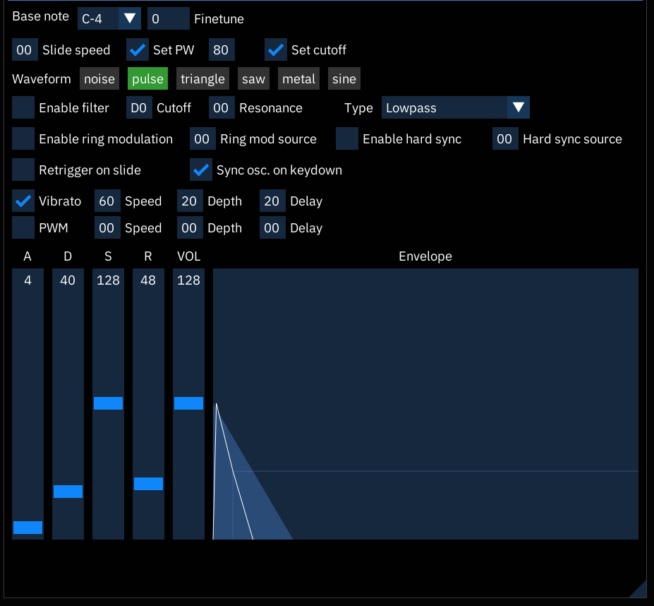
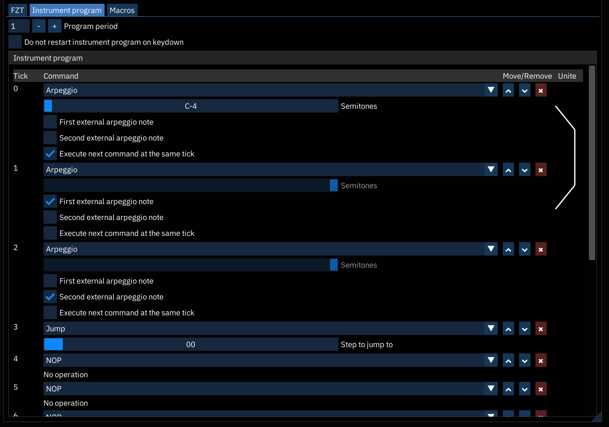

# FZT instrument editor

the FZT instrument editor consists of three tabs: "FZT" to control various parameters of sound channels, "Instrument program" to modify them (mostly for `.fzt` format compatibility) and "Macros" containing several macros.

## FZT

notice that the number input fields require entering numbers from keyboard. all numbers are hexadecimal except `Finetune` field.

- **Base note**: allows specifying a base note.
  - range is `C-0` to `B-7`.
  - how it works: when base note is `C-4` and you place `C-4` in pattern, `C-4` is played. when you place `C-3` there, `C-3` will be played. when you place `C-5` there, `C-5` will be played, and so on.
- **Finetune**: determines the detune from pure tone. `127` is just shy +0.5 semitones, `-128` is -0.5 semitones.
- **Slide speed**: determines the speed with which note slides. is usually overriden by `03xx` command.
- **Set PW**: set pulse width (duty) on new note.
  - next field is initial pulse width (00-FF).
- **Set cutoff**: set filter parameters on new note.
- **Waveform**: set initial waveform.
  - waveforms are mixed with bitwise AND rule.
  - metal enables short looped tonal noise mode (and enables noise even if `noise` is disabled).
  - `sine` is 8-bit 256-steps LUT sine wave.
- **Cutoff**: initial filter cutoff.
- **Resonance**: initial filter resonance.
- **Type**: initial filter type.
  - combined types can be used to achieve new sounds. E.g. lowpass + highpass gives notch (bandstop) filter.
- **Enable ring modulation**: when enabled, the channel's output will be multiplied with the source channel's.
- **Ring mod source**: the channel from which the modulation signal comes. `FF` means self-modulation (signal is effectively squared).
- **Enable hard sync**: enables oscillator hard sync. as the source channel's oscillator finishes a cycle, it resets the period of the channel's oscillator, forcing the latter to have the same base frequency. this can produce a harmonically rich sound, the timbre of which can be altered by varying the synchronized oscillator's frequency.
- **Hard sync source**: the channel from which the sync signal comes. `FF` means self-sync.
- **Retrigger on slide**: restart envelope and instrument program even if `03xx` effect is placed next to the note. notice that macros are not restarted in that case.
- **Sync osc. on keydown**: reset the phase of oscillator on new note. makes new notes "stand out" but may produce clicks.
- **Vibrato**: enable instrument vibrato. vibrato is done with triangle LFO.
  - the following settings can be overriden by `04xx` effect.
- **Vibrato speed**: how fast vibrato is.
- **Vibrato depth**: how "deep" vibrato is. `FF` means swing from -1 to +1 semitone.
- **Vibrato delay**: how many ticks to wait from new note. after specified number of ticks vibrato is enabled.
- **PWM**: enable instrument PWM (pulsolo, cyclic pulse width change). PWM is done with triangle LFO.
  - the following settings can be overriden by `11xy` effect.
- **PWM speed**: how fast PWM is.
- **PWM depth**: how "deep" PWM is. `FF` means full 0-100% duty range.
- **PWM delay**: how many ticks to wait from new note. after specified number of ticks PWM is enabled.

then comes the envelope editor part:

- **Attack**: determines the rising time for the sound. the bigger the value, the slower the attack. (0 to 255).
- **Decay**: determines the diminishing time for the sound. the higher the value, the longer the decay (0 to 255).
- **Sustain**: sets the volume level at which the sound stops decaying and holds steady (0 to 255).
- **Release**: determines the rate at which the sound fades out after note off. the higher the value, the longer the release (0 to 255).
- **Volume**: master volume of ADSR envelope on the channel (0 to 255).

## Instrument program

this is stolen klystrack instrument program.

program consists of 16 steps that are executed one by one sequentially.

by default a simple arpeggio program is set up so that `00xy` effect works.

- **Program period**: how many engine ticks it takes to advance one program step.
  - notice that if program period is higher than `1`, effects like portamento and filter cutoff/duty change are executed each tick, so they will be executed twice (for each program step) if program period is `2`.
- **Do not restart instrument program on keydown**: do not restart it on new note.

if you see `>` indicator near the `Tick` number, it marks current program position. thus you can slow down program execution by making prog period high or making tracker engine rate low and debug the program.

- **Execute next command on the same tick**: self-explanatory. a bracket is shown to indicate which steps will be executed simultaneously.

most of the entries in the program mirror the pattern effects. however, there are some that are unique to the program or behave differently:

- **Arpeggio**: first external note is `x` from `00xy`. second external note is `y` from `00xy`. `x` and `y` are derived from pattern effect.
- **Loop begin**: a marker that specifies start of the looping section.
- **Loop end**: a marker that specifies end of the looping section. the parameter denotes how many times the section is looped. e.g. `2` means that section will be executed `3` times (first time it goes through and then returns to the beginning 2 times, so total is `3`). if parameter is `0`, loop is infinite.
- **Jump**: immeditely jump to the specified step and start execution from there.
- **NOP**: do nothing, just waste `program period` ticks there and go to next step.
- **Program end**: stop program execution until it's started again by effect or new note.

## Macros

- **Volume**: volume sequence.
- **Arpeggio**: pitch sequence.
- **Pitch**: fine pitch.
- **Duty**: pulse width sequence.
- **Waveform**: select the waveform used by instrument.
- **Cutoff**: filter cutoff.
- **Filter mode**: select the filter mode.
- **Filter toggle**: turns filter on and off.
- **Resonance**: filter resonance sequence.
- **Phase Reset**: trigger restart of waveform.
- **Envelope Reset/Key Control**: start envelope, restart envelope or trigger envelope release.
- **Ring mod toggle**: turns ring mod on and off.
- **Ring mod source**: ring mod source channel. `4` is self-modulation.
- **Hard sync toggle**: turns hard sync on and off.
- **Hard sync source**: rhard sync source channel. `4` is self-sync.
- **Attack**: sets envelope attack speed.
  - if you modify attack speed when the envelope is in attack phase it immediately changes.
- **Decay**: sets envelope decay speed.
  - if you modify decay speed when envelope is in decay phase it immediately changes.
- **Sustain**: sets envelope sustain level.
  - if you modify sustain level when envelope is in sustain phase it immediately changes.
- **Release**: sets envelope release speed.
  - if you modify release speed when envelope is in release phase it immediately changes.
